# Cucumber Product Contracts Design

**Status:** Proposed for review  
**Date:** 2026-08-02  
**Supersedes:** [Product Journey Admission Design](./2026-08-01-product-journey-admission-design.md)

## Decision

Make checked-in Gherkin `.feature` files the sole human-maintained behavioral
contract for every product built with `maestro-template-saas-ui`. Execute those
contracts with Cucumber against the real browser, the canonical external CLI,
and one shared local Convex backend. Admit a product journey only when official
Cucumber Messages prove that every required scenario was selected once and
passed against the expected source SHA and backend identity.

This replaces the custom product-journey framework. Maestro should own only the
small amount of application-specific policy that Cucumber cannot know:

1. which lifecycle and surface tags a contract must contain;
2. which public product surfaces each journey owns;
3. whether the Cucumber Messages prove complete execution against one runtime.

Cucumber owns Gherkin parsing, tag expressions, scenario compilation, step
matching, hooks, execution, status semantics, snippets, and the message
protocol. Playwright owns browser automation. Node's `child_process` owns CLI
invocation. The existing Maestro local start path owns the runtime.

The result is a product-contract system, not another test-reporting framework.

## Outcome

The product-building loop becomes:

```mermaid
flowchart LR
  A[Example Mapping and product review] --> B[Reviewed .feature contract]
  B --> C[maestro create/add --spec]
  C --> D[Agents implement slices while @assembling]
  D --> E[Final change marks @admitted]
  E --> F[Cucumber drives real UI and external CLI]
  F --> G[Cucumber Messages NDJSON]
  G --> H[Deterministic completeness verifier]
  H --> I[ci/woodpecker/pr/verify]
  I --> J[Generated admission projection exposes journey]
```



Partial pull requests can merge without pretending the outcome is complete.
Their contract remains `@assembling`, and their public entrypoints remain dark.
The final lifecycle change cannot merge until the user-visible behavior really
works from the surfaces promised by the contract.

## Why The Current System Produces False Completion

The current gates are useful, but most prove source structure rather than a
working product outcome.

| Current evidence                                                        | What it proves                                                                           | What it does not prove                                                                                                               |
| ----------------------------------------------------------------------- | ---------------------------------------------------------------------------------------- | ------------------------------------------------------------------------------------------------------------------------------------ |
| Format, lint, types, build, dependency, schema, and architecture gates  | The repository is internally coherent and follows engineering rules.                     | A user or agent can complete the promised outcome.                                                                                   |
| Vitest unit and presenter tests                                         | Individual functions and rendered state projections behave under supplied inputs.        | The route, event handler, backend, authentication, and persistence are connected.                                                    |
| Confect manifest and headless-surface checks                            | Operations have declared schemas, surfaces, generated references, and typed errors.      | The generated CLI can execute them; today it may correctly return `FeatureDisabled`.                                                 |
| Generator snapshot/filesystem tests                                     | Expected files and registrations are emitted.                                            | Generated controls perform mutations or load real state.                                                                             |
| Recipe `doneState`, Build Pack `userJourneys`, and `acceptanceCriteria` | Humans wrote plausible completion prose.                                                 | Any command is causally connected to that prose or tests it.                                                                         |
| Generated CRUD proof                                                    | A separate in-memory HTTP fixture can create and read a record.                          | The generated browser, CLI, authentication, or Convex backend works.                                                                 |
| Hosted and visual smoke tests                                           | A shell renders and a deployment answers.                                                | The customer outcome is deployed or usable.                                                                                          |
| AI taste and contract review                                            | A reviewer can identify qualitative concerns.                                            | A deterministic behavior passed; an LLM must never mint that verdict.                                                                |
| Custom product-journey package and gate                                 | Manifest, graph, attestation, lease, inventory, and receipt structures can be validated. | A real browser or CLI performed the behavior. The gate is intentionally absent from root `verify` until a repository adapter exists. |

The generic `template:add-feature` generator makes the failure especially easy:
it emits fake-ready fixtures, an `Edit` button with no handler, and presenter
tests that pass. The canonical CLI imports an in-process compatibility function
without a runtime adapter and therefore returns `FeatureDisabled`. Both are
structurally honest, but neither is a working product.

This failure has occurred in practice. In the prior Signal Scout build, full
verification and generated-app proofs passed while the actual web shell was not
deployed; the missing product was discovered manually afterward. The relevant
local history is session `5c1fc73b-6a74-72d6-8569-c0704397f645`.

The custom replacement was moving in the wrong direction. Main already contains
5,755 lines in `packages/product-journey` and
`check-product-journeys.{mts,test.mts}` before a real repository adoption or one
real UI/CLI journey exists. The August 1 reference plan adds manifests, graphs,
witnesses, migration ledgers, attestations, leases, receipt schemas, generated
inventories, and adapters. Cucumber already supplies the behavior language,
compiler, runner, result model, and interoperable event stream.

## Alternatives Considered

### 1. Finish the custom journey-admission framework

Rejected. It creates a second workflow/test protocol that Maestro must maintain
and secure. Its types can prove that its own evidence objects are internally
consistent without proving the product emitted them through a real surface. The
reference implementation grows much faster than the product coverage.

### 2. Put Cucumber syntax on top of the current fake fixtures

Rejected. Gherkin would improve readability but preserve the false oracle. A
scenario that injects `fakeReadyState`, calls a CLI function in process, or
asserts a separately seeded database row is not end-to-end evidence.

### 3. Cucumber-native contracts against real local surfaces

Selected. It uses the smallest standard mechanism that expresses the contract in
natural language and produces deterministic machine results. Maestro adds policy
and runtime adapters, not a competing BDD platform.

## Contract Layout

Use Cucumber's conventional layout so generated apps do not need a proprietary
manifest format:

```text
features/
  client_records.feature
  step_definitions/
    client_records.steps.ts
  support/
    world.ts
    hooks.ts
    local-auth.ts
```

Feature files are the behavioral authority. Step definitions and support files
are executable adapters. Product topology and generated Confect metadata remain
technical ownership projections; they do not restate behavior.

Each feature has:

- exactly one stable `@journey_<snake_case_id>` tag;
- exactly one lifecycle tag: `@assembling`, `@admitted`, or `@suspended`;
- scenario-level surface tags such as `@ui`, `@cli`, and `@cross-surface`;
- negative-behavior tags such as `@authorization` and `@tenant-isolation` when
  the owned surface is authenticated or tenant-scoped;
- optional `@staging-proof` on scenarios that must also run against an exact-SHA
  staging deployment.

Do not maintain a parallel TypeScript journey manifest. The official Gherkin
parser reads the identifier, lifecycle, scenarios, rules, examples, and tags
directly from the feature document.

### Example Contract

```gherkin
@journey_client_records @assembling
Feature: Keep client requests in one trusted record
  Agency members and their automation need the same current record so that
  work does not diverge between the app and agent workflows.

  Rule: Authorized actors share one workspace-scoped record

    @ui
    Scenario: A member saves a client request in the app
      Given Maya is an active member of the Acme workspace
      And Acme has no request named "Homepage revision"
      When Maya saves the "Homepage revision" request in the app
      Then the app shows the saved request as ready

    @cli
    Scenario: An agent saves a client request from the CLI
      Given the Acme agent has permission to manage requests
      When the agent saves the "Homepage revision" request from the CLI
      Then the CLI returns the saved request

    @cross-surface
    Scenario: An agent sees a request created by a member
      Given Maya saved the "Homepage revision" request in the app
      When the Acme agent lists requests from the CLI
      Then the CLI includes the "Homepage revision" request

    @ui @authorization
    Scenario: A signed-out visitor cannot save a request
      Given a visitor is signed out
      When the visitor tries to save a request in the app
      Then the app asks the visitor to sign in

    @cli @tenant-isolation
    Scenario: Another workspace agent cannot read Acme requests
      Given Acme has a request named "Homepage revision"
      And the Birch agent is authenticated to the Birch workspace
      When the Birch agent asks for Acme requests from the CLI
      Then the CLI refuses the request without returning Acme data
```

The contract says what the actor observes, not which button selector, CLI flag,
HTTP route, table, or function implements it. Those details belong in step
definitions and can change without rewriting the product promise.

### Better Gherkin Rules

The Build Pack reviewer and static contract check enforce the intent of
Cucumber's Better Gherkin guidance:

- use product-domain language rather than implementation language;
- organize business rules with `Rule` and demonstrate them with concrete
  examples;
- keep scenarios independent and understandable without another scenario;
- give each scenario one primary action and one observable outcome;
- avoid conjunction-heavy steps and incidental UI or CLI mechanics;
- use a short `Background` only for context shared by every scenario in that
  rule;
- use `Scenario Outline` only when examples exercise the same rule;
- keep assertions visible to the actor. A direct database row is not a user
  outcome.

The checker should reject structural ambiguity, not attempt to judge writing
quality with an LLM. Product and contract CODEOWNERS review the language.

## Coverage Is Derived From Owned Surfaces

The static validator cross-checks scenario tags against real surface ownership.
It does not demand meaningless CLI scenarios for a static legal page or permit a
web-and-CLI capability to claim admission with only a browser scenario.

For an admitted journey:

- every owned `web` surface requires at least one real `@ui` scenario;
- every owned `cli` surface requires at least one real `@cli` scenario;
- ownership of both `web` and `cli` requires at least one `@cross-surface`
  scenario that observes state created through the other surface;
- authenticated ownership requires an `@authorization` denial scenario;
- tenant-scoped ownership requires a `@tenant-isolation` scenario;
- every scenario must contain executable steps; outlines must contain at least
  one example row;
- a scenario tagged for a surface the journey does not own is a contract error,
  not aspirational coverage.

The factory's normal product outcome should expose both UI and CLI surfaces.
Single-surface platform journeys remain valid when their actual ownership is
single-surface; the topology, rather than a hardcoded exception list, explains
why.

These are admission minimums, not the complete test strategy. Existing unit,
component, accessibility, type, schema, and security gates remain responsible
for lower-level code quality and states such as loading, empty, ready/edit,
toggle, and mutation failure where applicable. Product-important variants belong
in Gherkin when a user or agent would distinguish them.

## Lifecycle And Runtime Admission

### Assembling

`@assembling` means implementation may be incomplete. Contract syntax and
surface ownership are validated, but undefined steps and incomplete behavior do
not block unrelated slice pull requests. Public route and headless registries
resolve the journey as disabled. Unknown journey IDs also fail closed.

An assembling pull request may say which scenarios it advances. It may not say
the journey is complete.

### Admitted

`@admitted` is a source-controlled claim that every required scenario works. The
tag change selects the journey in required Cucumber execution. It cannot merge
when any step is undefined, ambiguous, pending, skipped, failed, retried,
unselected, or bound to the wrong runtime.

The generated admission projection enables its owned public entrypoints only in
the candidate build that is being tested. Branch protection prevents that build
from reaching main without the same commit's required verdict.

### Suspended

`@suspended` intentionally makes a formerly admitted journey dark. Use it for a
known product or security failure. An admitted journey cannot silently move back
to assembling. Returning from suspended to admitted reruns the complete
contract.

### Minimal Projection

`check-contracts.mts` generates one small, deterministic projection from feature
tags, conceptually:

```ts
export const admittedJourneys = {
  journey_client_records: false,
  journey_template_records: true,
} as const;
```

The exact file is generated and checked for drift. Routes and generated Confect
operation metadata carry `journeyId`. Shared web and headless dispatch
boundaries consult the projection before work begins. Direct public Convex
functions that bypass an owned dispatch boundary are rejected by the static
check; they must be internal or enter through a journey-owned guarded adapter.

This replaces runtime leases, signed admission attestations, graph witnesses,
and custom journey receipts. Required CI, protected main, exact-SHA deployment,
and server-side tenant authorization are the trust chain. If those controls are
not configured, admission is not trustworthy and release must stop.

## Reuse Existing Surface Inventories

Do not build a new AST scanner or release-surface graph.

Add `journeyId` to the registries that already define public behavior:

| Surface                            | Existing authority to extend                             | Check                                                                                                  |
| ---------------------------------- | -------------------------------------------------------- | ------------------------------------------------------------------------------------------------------ |
| Browser route                      | Product topology / generated TanStack route registration | Every active product route has one known journey owner.                                                |
| Web capability                     | Generated Confect contract metadata                      | Every public web operation has one known journey owner and guarded dispatch.                           |
| CLI/API/MCP capability             | The same generated Confect manifest                      | CLI/API/MCP projections inherit the operation's one journey owner.                                     |
| Workflow or job surfaced to a user | Existing system topology and workflow registration       | The public trigger belongs to a journey; internal implementation nodes do not need separate contracts. |

The existing system-topology discovery already finds workspace routes, Confect
specs, workflows, jobs, and headless modules. Contract validation consumes that
inventory instead of maintaining `affectedPaths`, journey graphs, or a second
surface census.

Static validation fails for:

- an active public surface with no journey owner;
- a journey ID that does not resolve to a feature;
- two journeys claiming one surface;
- a lifecycle tag missing or duplicated;
- an admitted journey without required surface or denial scenarios;
- an assembling or suspended surface that is enabled in the generated
  projection;
- generated projection drift;
- deletion or renaming of a still-owned journey;
- `@admitted -> @assembling` lifecycle regression.

## One Real Local Runtime

Required pull-request acceptance runs in the existing `local` start mode, never
the `fake` mode.

```text
Cucumber process
  ├── Playwright browser ──> Vite web app ──> authenticated Convex client ─┐
  ├── child_process CLI ──> Convex HTTP API ──> API-key authorization ─────┤
  └── fixture/bootstrap hooks ──> local-only internal setup ───────────────┤
                                                                         v
                                                               one local Convex
```

The support hook starts `maestro start --mode local`, which already supervises
Vite, local Convex, and Confect generation. The hook waits for the declared
readiness surfaces and stops every child in `AfterAll`, including failure and
signal paths.

### Browser Driver

Playwright opens the built application and interacts through accessible roles,
labels, and user-visible text. A step may not import a React component, pass a
prebuilt view state, call its handler directly, or substitute a fixture adapter
for the browser route. Screenshots and traces are useful debugging artifacts but
are never pass evidence.

### CLI Driver

Steps invoke the repository's canonical executable as an external process. They
do not import `runCli`, `runTemplateApiOperation`, a handler, or a runtime
adapter. The spawned CLI receives only the same inputs an agent receives:
executable arguments, API base URL, a scoped credential, and ordinary process
environment.

The production CLI path must call the generated HTTP API. The current in-process
compatibility path that returns `FeatureDisabled` is removed. A caller-provided
workspace selector may be retained as a target assertion, but it is never tenant
authority.

### Backend And Providers

Convex persistence, Confect operations, route dispatch, authentication checks,
and workspace membership are real local implementations. External providers such
as an LLM, email, billing, storage, or analytics may use deterministic fake
adapters, but only behind the real server-owned provider boundary. A fake
provider must produce the same typed server result or durable intent that the
application consumes; it cannot replace the application workflow.

No acceptance scenario may use the standalone `crud-proof.ts` server or a fake
web adapter.

## Authentication And Tenant Safety

The local test environment must exercise the same authorization decisions as
production without depending on WorkOS or customer credentials.

### UI Identity

An ephemeral local issuer creates an RSA keypair and serves only its public JWKS
on loopback. It signs a short-lived JWT for the scenario's synthetic member. The
local AuthKit adapter supplies that token through the normal Convex client
authentication interface. Convex validates issuer, audience, signature, and
expiry, resolves `identity.subject` to the user row, and loads current workspace
membership through `requireWorkspaceAccess`.

The private key stays in the Cucumber process and is never written to the
repository or emitted in messages.

### CLI Agent Identity

The scenario bootstrap creates a real, short-lived API-key row for a synthetic
agent. The CLI sends the opaque bearer key to the real HTTP endpoint. The
backend hashes and verifies it, checks status, expiry, and scope, and derives
the authorized workspace from the key row.

Request JSON, route parameters, and `--workspace` values cannot grant workspace
authority. A mismatched requested workspace is rejected before dispatch. The
current hardcoded `acme-demo` workspace resolution is not part of acceptance.

### Fixture Boundary

Before each scenario, a local-only internal bootstrap may create only legitimate
starting state:

- synthetic organizations, workspaces, active users, and memberships;
- scoped, expiring API keys;
- domain records explicitly named in `Given` steps;
- deterministic provider responses needed for the starting condition.

It may not create the state that a `When` step promises to produce, skip a
product-owned transition, or repair a failed result. `Then` steps observe the UI
or CLI. Direct database inspection is limited to fixture cleanup and harness
identity, not the outcome oracle.

Every scenario receives a unique run and tenant namespace. Scenarios do not
share mutable World state. The one intentional sharing test occurs inside a
single `@cross-surface` scenario.

Acceptance-only auth and bootstrap code is unreachable in production mode. The
existing auth-demo-bypass gate is extended to prove that a production build
cannot select the local issuer, synthetic identity, or bootstrap entrypoint.

## Cucumber Execution Model

Use `@cucumber/cucumber` 13.2.0. Its Node engine supports the repository's
pinned Node 22.12 runtime. Pin the official parser and protocol versions used
directly by Maestro's validators (`@cucumber/gherkin` 41.0.0 and
`@cucumber/messages` 34.0.1) rather than importing transitive packages.
Playwright and `tsx` are already installed. No other BDD, retry, report, or
browser framework is needed.

### Scenario World

The custom World owns only scenario-scoped adapters and observations:

- browser context and page;
- synthetic actor and tenant identities;
- CLI process result;
- expected source SHA and runtime identity;
- cleanup handles.

Do not put business logic or shared mutable test state in the World.

### Steps

Step definitions translate product language into one of three actions:

1. establish legitimate initial state through the local bootstrap;
2. interact through Playwright or the external CLI;
3. assert actor-visible output through those surfaces.

Reuse domain steps when their meaning is genuinely identical. Do not create a
generic step DSL, page-object hierarchy, or step generator. Cucumber's undefined
step snippets are the native implementation queue. Ambiguous step matches fail.

### Hooks

- `BeforeAll`: allocate ports, start the local issuer and
  `maestro start --mode local`, then verify readiness and build identity.
- `Before`: allocate isolated actors, tenant, API key, browser context, and
  fixture namespace.
- `After`: close the browser context and remove scenario-local data.
- `AfterAll`: stop all supervised children and the JWKS server.

There are no retries. Initial execution is sequential. Official Cucumber
parallelism or sharding may be added only after measured runtime requires it and
scenario isolation is proven.

## Cucumber Messages Are The Behavior Evidence

Run Cucumber with the official message formatter and retain the resulting
newline-delimited `Envelope` stream as the sole machine evidence for the
behavior verdict. Console text, a screenshot, a PR checklist, an LLM review, or
a custom passing JSON receipt cannot substitute for it.

The support code attaches a small redacted runtime identity document to each
scenario. It contains:

- evidence schema version;
- expected repository SHA;
- web build SHA and base URL;
- CLI build SHA and executable identity;
- Convex deployment/runtime identity and API URL;
- journey ID and scenario pickle ID.

It contains no tokens, cookies, API keys, raw customer content, or environment
dump. UI and CLI observations must report the same backend identity. The
cross-surface scenario additionally proves this causally by observing state
created through the other surface.

### Deterministic Verifier

`verify-messages.mts` reads only the expected contract inventory, CI source SHA,
and the Cucumber Messages file. It fails unless all of the following are true:

1. the stream is valid for the pinned Messages protocol;
2. at least one admitted scenario was selected and executed;
3. every scenario compiled from every admitted feature has exactly one matching
   `testCaseStarted` execution;
4. every required journey and surface/negative coverage class is represented;
5. every test step and hook result has status `PASSED`;
6. no scenario reports `willBeRetried`, no retry attempt exists, and no pickle
   executes twice;
7. each scenario has one valid redacted runtime identity attachment;
8. web, CLI, and backend identities agree where those surfaces apply;
9. every observed build SHA equals the Woodpecker checkout SHA;
10. no unknown admitted journey, unowned scenario, malformed attachment, or
    truncated execution remains.

Statuses including `UNKNOWN`, `SKIPPED`, `PENDING`, `UNDEFINED`, `AMBIGUOUS`,
and `FAILED` are failures. Empty tag selection is a failure even if Cucumber's
process exits successfully.

The verifier does not interpret prose or ask an AI whether the scenario was good
enough. Contract quality is a product-review responsibility; execution
completeness is deterministic.

An HTML or JUnit view may later be rendered from the same Messages artifact for
humans. It is unnecessary for the first release and is not an authority.

## Commands And Developer Experience

Keep the interface small:

- `pnpm acceptance:check` parses contracts, validates tags and ownership, and
  checks the generated admission projection;
- `pnpm acceptance` starts the real local runtime through hooks, executes all
  admitted scenarios, emits Messages, and verifies completeness;
- `pnpm exec cucumber-js --tags @journey_client_records` gives an agent the
  normal focused Cucumber loop and undefined-step snippets;
- existing `maestro verify --scope full` and root `pnpm verify` include required
  acceptance rather than producing a separate completion badge.

Do not add a custom journey dashboard, receipt browser, graph renderer,
attestation CLI, or scenario scaffold command. Cucumber's tag selection,
formatter output, snippets, and Messages are sufficient until measured usage
shows a real gap.

## Factory Integration

### Create

Replace prose-only outcome input with one or more reviewed contracts:

```text
maestro create <target> --name "My App" --spec features/client_records.feature
```

`--spec` is repeatable. The Feature title supplies the display outcome that is
currently stored as `personalization.firstOutcome`. `--outcome` is removed after
a short explicit CLI migration error; the factory never silently converts one
sentence into an admitted contract.

Create validates Gherkin, requires `@assembling` for customer outcomes, copies
the feature files into the generated application, and writes the disabled
admission projection. The resulting app may include the template's small,
admitted reference journey to prove the harness, but it must not claim the
customer's assembling outcome works.

The next immutable template release contains Cucumber dependencies, support
code, real local runtime wiring, surface ownership fields, Woodpecker
configuration, and the reference contract. Never mutate the already sealed
`v0.2.0-alpha.2` release.

### Add

Replace free-form `maestro add <outcome-or-recipe>` completion semantics with:

```text
maestro add --spec features/approval_workflow.feature
```

Add installs a syntactically valid assembling contract and reports its journey
ID, rules, scenarios, and undefined steps. It does not emit fake-ready product
UI. Existing focused generators for tables, capabilities, workflows, and agents
remain implementation tools; they are selected after the behavior is clear.

Delete recipe `doneState`. Recipes may retain technical prerequisites and
focused engineering gates, but they cannot define product completion. Work
packages reference feature/scenario names instead.

### Generated Feature Code

Remove the generic `template:add-feature` output that creates fake fixtures,
presenter-only tests, and a no-op edit control. A natural-language contract plus
Cucumber's undefined steps is more honest than a generic implementation that
looks finished. Agents may use the existing narrow generators to add real domain
pieces, then implement the thinnest UI and CLI adapters required by the
contract.

### Upgrade

Upgrading an existing customer app installs the harness and imports proposed
contracts as `@assembling`. It never infers admission from old unit tests,
recipes, prose acceptance criteria, or a previous green build. Existing public
surfaces must be mapped and exercised before their journeys become admitted;
until then, the upgrade report names the migration gap explicitly.

## Brain And Build Pack Integration

The Build Pack should use Example Mapping during product discovery:

```text
Story / outcome
  -> business rules
  -> concrete examples
  -> unresolved questions
  -> reviewed Gherkin features
```

The `specify` stage produces parseable Gherkin files. The `review` stage checks
the examples with the product owner, including UI, CLI, cross-surface,
authorization, and tenant-isolation behavior. The `compile` stage exports those
exact bytes. The `map-to-maestro` stage passes file paths/content to
`maestro create --spec` or `maestro add --spec`.

Build Pack schema evolves from independent prose arrays to a canonical contract
collection such as `{ path, gherkin }[]`. During compatibility migration:

- `userJourneys` is derived from Feature, Rule, and Scenario names;
- `acceptanceCriteria` is derived for display from observable `Then` steps;
- Maestro mapping consumes the Gherkin contract files, never concatenates those
  two projections into a list called `gates`;
- handoff prompts tell agents to make named scenarios pass, not to interpret a
  second prose checklist.

Generated Gherkin may be assisted by an LLM, but it is not authoritative until
it parses and a human/product-review step accepts the examples. No LLM
participates in the execution verdict.

For the Brain pilot, the first contract should express the real customer outcome
rather than internal hydration nodes: an authorized member activates existing
client context, resolves required conflicts, and produces grounded content with
durable citations; an agent can inspect or initiate the same outcome through the
CLI; foreign-tenant and insufficient-role actors are denied. Detailed Brain
implementation receipts remain internal observability, not a second behavioral
contract.

## Pull Requests And Parallel Slices

The journey, not a slice or pull request, is the completion unit.

1. Product review lands an assembling feature contract before fan-out.
2. Work packages name the scenarios or steps they implement and retain normal
   focused engineering gates.
3. Slice PRs may merge while the feature remains assembling and public surfaces
   remain disabled.
4. Agents run the focused journey locally as wiring becomes available.
5. The integration PR changes only a genuinely ready journey to admitted and
   resolves every undefined or failing step.
6. Required CI executes all admitted journeys, not only files guessed to be
   affected.

Initially, all admitted scenarios run on every pull request. Affected-journey
selection is deliberately omitted: it is another correctness policy and the
current number of journeys does not justify it. Add official Cucumber sharding
only when measured wall time becomes unacceptable; retain complete message
coverage verification across shards.

## Woodpecker Is The Admission Authority

The repository is currently misconfigured for the desired trust model:

- GitHub reports no required status contexts or repository ruleset;
- main has no Woodpecker pipeline configuration;
- GitHub Actions is still active;
- deterministic gate definitions still encode retired Buildkite paths;
- Qlty is invoked in the blocking root verify chain.

Cut over without an unprotected gap:

1. add and observe a Woodpecker pull-request pipeline on a test PR;
2. ensure its exact GitHub status context is `ci/woodpecker/pr/verify`;
3. configure branch protection to require that exact context and at least one
   non-author approval for protected contract/control-plane changes;
4. protect `features/**`, acceptance support/verifiers, admission projection
   generation, and Woodpecker configuration with CODEOWNERS;
5. remove GitHub Actions and retired Buildkite as admission authorities;
6. remove Qlty from the blocking deterministic chain and run it with the
   operator's 30-second cap as advisory output only.

The required Woodpecker job runs the clean checkout's full deterministic chain,
including `pnpm acceptance`, with no retries. It uploads Cucumber Messages and
Playwright diagnostics on success or failure. A later release job may run
`@staging-proof` scenarios against an exact-SHA staging deployment before
production promotion, using the same feature and verifier.

Branch protection is an external configuration requirement, not something a
repository file can self-attest. A release preflight must query GitHub and stop
when the exact required context or review protection is missing.

## Gate Integrity

An implementation agent could otherwise make a failing product green by
weakening the feature or step definition. Use simple source-control controls
rather than a second attestation system:

- Gherkin contracts, lifecycle tags, step definitions, runtime hooks, static
  validation, message verification, and CI configuration are CODEOWNED;
- the author cannot provide the required approval for their own contract or
  control-plane reduction;
- static minimum coverage prevents deleting all UI, CLI, cross-surface, auth, or
  tenant scenarios while keeping the owned surfaces;
- zero selection and duplicate/retried execution fail from Messages;
- generated admission state cannot be hand-edited;
- implementation and contract may change together, but a codeowner must review
  any change to the promised behavior.

This does not prove that natural-language examples are perfect. It makes the
oracle explicit, reviewable, versioned, and executable. New incidents or missed
requirements become new scenarios in the same contract.

## Mutation Gauntlet

The template release is not credible until a freshly generated customer app
passes normally and the harness catches these deliberate faults one at a time:

| Mutation                                             | Required red evidence                                          |
| ---------------------------------------------------- | -------------------------------------------------------------- |
| Remove or disconnect the Save handler                | The `@ui` scenario fails.                                      |
| Restore the CLI compatibility `FeatureDisabled` path | The `@cli` scenario fails.                                     |
| Point the CLI at a second backend                    | The `@cross-surface` scenario or runtime identity check fails. |
| Trust caller-supplied workspace identity             | The `@tenant-isolation` scenario fails.                        |
| Select a tag expression matching no scenarios        | `verify-messages.mts` fails positive execution and coverage.   |

Run this gauntlet for changes to the factory acceptance harness and before
sealing a template release. Ordinary customer-app pull requests run the real
contracts, not the five synthetic mutations.

## Deletion And Simplification

Remove or supersede the following after the Cucumber reference journey and
mutation gauntlet are green:

- `packages/product-journey/`;
- `tooling/quality/check-product-journeys.mts` and its tests/fixtures;
- custom journey manifests, graphs, witnesses, inventories, adapters,
  migrations, leases, attestations, generic receipts, runners, and generators;
- the August 1 product-journey design and implementation plan as active
  authority (retain them only as superseded history);
- recipe `doneState` and mappings that treat prose acceptance criteria as shell
  gates;
- the standalone generated CRUD proof;
- fake-ready/no-op `template:add-feature` output;
- the in-process CLI compatibility path that can only return `FeatureDisabled`;
- blocking Buildkite/GitHub-era CI authority and blocking Qlty invocation.

The replacement should have only two substantive Maestro validators:

1. `tooling/acceptance/check-contracts.mts` for official Gherkin parsing,
   lifecycle/surface policy, ownership, transition checks, and projection drift;
2. `tooling/acceptance/verify-messages.mts` for positive execution, complete
   coverage, pass-only statuses, no retries, and runtime/SHA identity.

Hooks, step definitions, and auth fixtures are necessary test adapters, not a
new framework. The intended change is net deletion. The already-landed custom
core alone is 5,755 lines; removing duplicate generator and retired CI wiring
should take the broader simplification beyond 10,000 lines. Measure the final
diff rather than preserving code to meet an estimate.

## Rollout Sequence

### 1. Prove The Harness In The Template

Add the official Cucumber packages, conventional feature layout, local runtime
hooks, real UI auth, real CLI HTTP transport, the two validators, and one small
admitted reference journey. Make the reference journey prove UI create, CLI
read/write, cross-surface visibility, auth denial, and tenant isolation.

### 2. Prove The Oracle

Run the five-mutation gauntlet against a freshly generated app. Do not migrate
product contracts until each defect creates the expected red result.

### 3. Make The Factory Contract-First

Switch `create` and `add` to repeatable `--spec`, derive the display outcome
from Feature titles, remove `doneState` and fake-ready feature generation, and
seal a new immutable release.

### 4. Make Brain Emit Contracts

Add Example Mapping review and canonical Gherkin export to Build Packs. Keep
`userJourneys` and `acceptanceCriteria` as derived compatibility projections for
one schema migration, then remove them as independent inputs.

### 5. Adopt Without False Admission

Install the harness in current template-derived apps. Map public surfaces and
add contracts as assembling. Admit one journey at a time only after its real
UI/CLI suite passes. Brain hydration is the first Maestro product pilot.

### 6. Cut Over CI And Delete The Old System

Observe Woodpecker's exact status on a PR, enable branch protection and
CODEOWNERS, then remove retired admission authorities and custom journey
machinery. Never rely on a repository claim that branch protection exists.

This sequence is architectural ordering, not the implementation task plan. A
file-by-file, test-first implementation plan follows only after this design is
reviewed.

## Failure Behavior

The system fails closed and points to the smallest useful repair:

- malformed Gherkin: report file, line, and parser error;
- invalid/missing tags: report feature and exact required tag class;
- unowned surface: report registry source and missing journey ID;
- undefined or ambiguous step: use Cucumber's native snippet/ambiguity output;
- runtime startup failure: report the first failed supervised child and retain
  redacted logs;
- browser failure: retain Playwright trace/screenshot and failed Cucumber step;
- CLI failure: retain exit code plus redacted stdout/stderr;
- identity mismatch: print expected and observed non-secret SHA/runtime fields;
- missing scenario execution: name the exact journey, scenario, and coverage
  class absent from Messages;
- cleanup failure: fail the run so leaked state or processes are not hidden.

The runner never inserts downstream state to continue after a broken boundary.

## Guarantees And Limits

When configured as designed, an admitted journey means:

- its reviewed natural-language examples are versioned with the code;
- every required example was selected exactly once and passed;
- the UI path used a real browser;
- the CLI path used the external executable an agent uses;
- both paths used the same real local backend and expected code identity;
- tenant and authorization denial examples passed;
- partial assembling behavior remained dark;
- required CI and independent review approved the exact commit.

It does not mean:

- the examples cover every possible requirement or production data shape;
- deterministic fake providers perfectly reproduce third-party outages;
- local proof replaces exact-SHA staging scenarios for deployment-specific
  risks;
- Cucumber replaces unit, type, schema, accessibility, visual, performance, or
  security testing;
- a green repository is trustworthy when branch protection or the required
  Woodpecker context is missing.

The honest claim is narrower and much stronger than today's: the behavior we
said mattered was actually executed through the surfaces we said users and
agents would use.

## Success Criteria

The design is successful when all of the following are demonstrably true:

1. A reviewed `.feature` file is the only manually maintained behavioral
   completion contract for a generated app.
2. `maestro create --spec` and `maestro add --spec` install assembling contracts
   without pretending their outcomes work.
3. An assembling journey is unreachable through its owned public UI and headless
   entrypoints.
4. An admitted journey cannot merge unless every required UI, CLI,
   cross-surface, authorization, and tenant scenario passes exactly once.
5. UI and CLI scenarios operate on the same Convex state and expected source
   SHA.
6. Caller-controlled workspace input cannot grant tenant access.
7. Zero selected scenarios, undefined steps, skipped results, retries, runtime
   drift, and backend drift all produce deterministic failure.
8. The five-mutation generated-app gauntlet catches all five faults.
9. Woodpecker exposes and branch protection requires exactly
   `ci/woodpecker/pr/verify`; Qlty remains advisory.
10. Build Packs export reviewed Gherkin instead of independent journey and
    acceptance prose.
11. The custom journey framework and duplicate fake proof machinery are deleted.
12. A real Brain journey passes from UI and CLI without intermediate outcome
    seeding before it is called complete.

## Official References

- [Cucumber documentation](https://cucumber.io/docs/cucumber/)
- [Better Gherkin](https://cucumber.io/docs/bdd/better-gherkin/)
- [10-minute tutorial](https://cucumber.io/docs/guides/10-minute-tutorial/)
- [Gherkin reference](https://cucumber.io/docs/gherkin/reference/)
- [Cucumber API and hooks](https://cucumber.io/docs/cucumber/api/)
- [Scenario state and isolation](https://cucumber.io/docs/cucumber/state/)
- [Cucumber reporting](https://cucumber.io/docs/cucumber/reporting/)
- [Cucumber Messages protocol](https://github.com/cucumber/messages)

## Separate Security Follow-Up

Repository hook inspection during this design exposed an embedded webhook
credential in command output. Its value is intentionally omitted here. Rotate
that credential through the owning provider separately; this design did not
authorize an external credential change.
