# Cucumber Product Contracts Design

**Status:** Proposed for review  
**Date:** 2026-08-02  
**Supersedes:** [Product Journey Admission Design](./2026-08-01-product-journey-admission-design.md)

## Decision

Make checked-in Gherkin `.feature` files the sole human-maintained behavioral
contract for products built with `maestro-template-saas-ui`. Execute admitted
contracts with Cucumber against the real browser, the canonical built CLI, and
one real backend. Use official Cucumber Messages as the execution record and a
small Maestro verifier to prove exact contract selection, pass-only results, and
independently observed runtime identity.

Maestro owns only policy and integration that Cucumber cannot know:

1. the stable journey, lifecycle, transport, security, and coverage tags;
2. the exhaustive inventory of public product entrypoints;
3. which newly introduced entrypoints remain dark until a journey is admitted;
4. whether Messages exactly cover the checked-in contract bytes;
5. whether protected adapters observed the expected UI, CLI, and backend
   identities;
6. whether the verdict was produced for the current protected merge-group tuple.

Cucumber owns Gherkin parsing, scenario compilation, tag expressions, step
matching, hooks, execution, status semantics, snippets, and the Messages
protocol. Playwright owns browser automation. Node `child_process` owns external
CLI invocation. Existing Maestro process supervision owns runtime lifecycle.

This replaces the custom journey framework. It does not turn Cucumber Messages
into a cryptographic attestation system: test execution still trusts the
CODEOWNED steps, support adapters, runtime supervisor, verifier, and CI control
plane. Admission means those protected components executed the reviewed contract
and observed the stated real surfaces. It does not mean unreviewed test code
cannot lie.

## Outcome

The product-building loop becomes:

```mermaid
flowchart LR
  A[Example Mapping and product review] --> B[Reviewed assembling Feature]
  B --> C[maestro create or contracts add]
  C --> D[Stacked slice PRs keep journey assembling]
  D --> E[Static ownership and darkness checks]
  E --> F[Final integration PR targets current protected main]
  F --> G[Change lifecycle to admitted]
  G --> H[Secretless Cucumber UI and CLI execution]
  H --> I[Strict Messages and runtime verifier]
  I --> J[Merge candidate ci/woodpecker/pr/verify]
  J --> K[Protected merge exposes new entrypoints]
```



Stacked slice PRs are implementation units, not completion units. They may land
while a journey is `@assembling`; newly introduced controls and operations for
that journey remain dark. Only the final integration PR, after every dependency
and the assembling Feature are present in protected main, changes the journey to
`@admitted` and adds it to required execution.

Once a journey is admitted, its scenarios run on every later pull request. The
first admission is verified at the end of the stack; regression protection is
continuous afterward.

## What The Verdict Can And Cannot Prove

When the trust chain is configured, an admitted journey proves:

- the exact reviewed Gherkin source bytes were selected;
- every compiled Pickle, including every Scenario Outline example row, ran
  exactly once with valid Source/Gherkin AST linkage;
- every scenario step, scenario hook, run hook, and run result passed;
- protected UI and CLI adapters observed the expected built artifacts;
- surface-owned identity endpoints reported one backend runtime;
- required denial behavior passed for each distinct authentication transport;
- the result belongs to the exact protected merge-group tuple being admitted.

The verdict depends on protected test and CI code. Cucumber Messages alone do
not prove that a step used Playwright or spawned a process; they prove that the
registered step passed and record its attachments. Maestro therefore protects
the adapters, runs the controller/evidence store outside candidate namespaces,
makes runtime identity server-owned rather than caller-supplied, and runs
mutation tests that replace real Action/Outcome steps with no-ops.

The verdict does not prove:

- the examples cover every requirement or production data shape;
- product-review language is perfect;
- deterministic provider fakes reproduce every third-party failure;
- local proof covers deployment-specific risk;
- a green status is trustworthy without secretless CI, protected control code,
  current-base verification, and required code-owner review.

## Why The Current System Produces False Completion

The current gates mostly prove source structure rather than a working outcome.

| Current evidence                                                        | What it proves                                                                      | What it does not prove                                                                                                 |
| ----------------------------------------------------------------------- | ----------------------------------------------------------------------------------- | ---------------------------------------------------------------------------------------------------------------------- |
| Format, lint, types, build, dependency, schema, and architecture gates  | The repository is coherent and follows engineering rules.                           | A user or agent can complete the promised outcome.                                                                     |
| Vitest unit and presenter tests                                         | Functions and state projections behave under supplied inputs.                       | The route, event handler, backend, authentication, and persistence are connected.                                      |
| Confect manifest and headless-surface checks                            | Operations have declared schemas, surfaces, generated references, and typed errors. | The generated CLI can execute them; today it may correctly return `FeatureDisabled`.                                   |
| Generator snapshot/filesystem tests                                     | Expected files and registrations are emitted.                                       | Generated controls perform mutations or load real state.                                                               |
| Recipe `doneState`, Build Pack `userJourneys`, and `acceptanceCriteria` | Humans or an LLM wrote plausible completion prose.                                  | Any command is causally connected to that prose or tests it.                                                           |
| Generated CRUD proof                                                    | A separate in-memory HTTP fixture can create and read a record.                     | The generated browser, CLI, authentication, or Convex backend works.                                                   |
| Hosted and visual smoke tests                                           | A shell renders and a deployment answers.                                           | The customer outcome is deployed or usable.                                                                            |
| AI taste and contract review                                            | A reviewer can identify qualitative concerns.                                       | A deterministic behavior passed; an LLM must never mint that verdict.                                                  |
| Custom product-journey package and gate                                 | Custom evidence structures are internally valid.                                    | A real browser or CLI performed the behavior. The gate is absent from root `verify` until a repository adapter exists. |

The generic `template:add-feature` generator demonstrates the failure: it can
emit fake-ready state and a no-op control while presenter tests pass. The
canonical CLI currently imports an in-process compatibility function and can
return `FeatureDisabled`. Both paths are structurally honest, but neither is a
working product.

The custom replacement was growing in the wrong direction. Main already contains
5,755 lines in `packages/product-journey` and
`check-product-journeys.{mts,test.mts}` before one real UI/CLI journey exists.
Cucumber supplies the behavior language, compiler, runner, result model, and
interoperable event stream. Maestro should not maintain a second BDD protocol.

## Alternatives Considered

### Finish the custom journey-admission framework

Rejected. It creates a second workflow and evidence protocol that Maestro must
maintain and secure. Its objects can agree with one another without proving
product behavior.

### Add Gherkin syntax over fake fixtures

Rejected. A scenario that injects fake-ready state, calls a CLI function in
process, or asserts a separately seeded database row preserves the false oracle.

### Run full acceptance on every assembling slice

Rejected. An incomplete journey is expected to fail and should not make every
stack layer red. Existing admitted journeys still run for regressions, but the
new journey joins required execution only in its final admission PR.

### Admit at the end of a stacked change

Selected. Slice PRs retain static engineering gates and prove new entrypoints
are dark. The final current-main integration PR is the only completion claim.
GitHub stacked PRs organize dependencies; protected main and its merge queue
remain the admission boundary.

## Contract Layout And Cucumber Configuration

Use a conventional layout plus one explicit checked-in configuration:

```text
features/
  client_records.feature
  step_definitions/
    client_records.steps.ts
  support/
    world.ts
    hooks.ts
    local-auth.ts
cucumber.cjs
```

The repository root is CommonJS. The selected profile in `cucumber.cjs` is an
exact allowlist containing only:

- `requireModule: ["tsx/cjs"]`;
- `require: ["features/**/*.ts"]`;
- `retry: 0`;
- `parallel: 0`.

No other profile or option is allowed. In particular, shared configuration
contains no `paths`, `tags`, `name`, `shard`, order, formatter, or other
selector/execution key; `retry` and `parallel` remain fixed at zero. Cucumber
merges configured paths additively and tag expressions conjunctively, so
defaults would contaminate exact selection and make assembling-focused runs
empty. The protected runner supplies the complete authoritative path list,
`@admitted` expression, `message` formatter, and output path. Dry-run and
focused commands likewise supply their complete paths and tag expressions.

Pin `@cucumber/cucumber@13.2.0`, `@cucumber/gherkin@41.0.0`, and
`@cucumber/messages@34.0.1` in the lockfile, and run them on the repository's
Node 22 line. The static checker rejects an unreviewed version mismatch between
the compiler used for expected Pickles and the Messages types used by the
verifier.

`check-contracts.mts` rejects every configuration key outside the four-key
allowlist; the protected launcher owns the exact invocation. Messages can prove
that no retry occurred; the checked configuration proves retries were disabled.
Parallel workers and sharding are outside this design. They require a separate
design for coordinator hooks, runtime sharing, port allocation, and multi-stream
coverage equality.

Feature files are the behavioral authority. Step definitions and support files
are executable adapters. The generated surface inventory and admission
projection remain technical projections; they do not restate behavior.

## Contract Identity And Reserved Tags

Each Feature has, directly on the Feature node:

- exactly one globally unique `@journey_<snake_case_id>`;
- exactly one lifecycle tag: `@assembling`, `@admitted`, or `@suspended`;
- no lifecycle or journey tag on a Rule, Scenario, Scenario Outline, or Examples
  node.

Executable Scenario, Scenario Outline, or Examples nodes carry:

- one or more transport tags from `@ui`, `@cli`, `@api`, `@mcp`, and `@webhook`;
- generated coverage tags such as `@covers_records_create`;
- `@cross-surface` only together with every transport it exercises;
- denial tags such as `@authentication`, `@authorization`, and
  `@tenant-isolation` for the specific transport under test;
- optional `@staging-proof` when the same example must run against staging.

Tags inherit in Cucumber and do not override one another. The validator rejects
reserved journey/lifecycle tags below Feature and rejects transport/coverage
tags placed at Feature level. Every compiled Pickle must have exactly one
effective journey, lifecycle, and required transport classification.

Journey identity is the stable journey tag. Feature titles, paths, Rule names,
and Scenario prose may improve without creating a new journey. A journey tag is
stored without its leading `@` in generated data and CLI arguments. An
assembling journey may be renamed while it has no admitted history. An admitted
journey ID is immutable: replacement requires suspending the old journey and
introducing a new ID rather than disguising deletion as a rename.

## Example Contract

```gherkin
@journey_client_records @assembling
Feature: Keep client requests in one trusted record
  Agency members and their automation need the same current record so that
  work does not diverge between the app and agent workflows.

  Rule: Authorized actors share one workspace-scoped record

    @ui @covers_records_create_web
    Scenario: A member saves a client request in the app
      Given Maya is an active member of the Acme workspace
      And Acme has no request named "Homepage revision"
      When Maya saves the "Homepage revision" request in the app
      Then the app shows the saved request as ready

    @cli @covers_records_create_cli
    Scenario: An agent saves a client request from the CLI
      Given the Acme agent has permission to manage requests
      When the agent saves the "Homepage revision" request from the CLI
      Then the CLI returns the saved request

    @ui @cli @cross-surface @covers_records_create_web @covers_records_list_cli
    Scenario: An agent sees a request created by a member
      Given Maya saved the "Homepage revision" request in the app
      When the Acme agent lists requests from the CLI
      Then the CLI includes the "Homepage revision" request

    @ui @authentication @covers_records_create_web
    Scenario: A signed-out visitor cannot save a request
      Given a visitor is signed out
      When the visitor tries to save a request in the app
      Then the app asks the visitor to sign in

    @ui @authorization @covers_records_create_web
    Scenario: A read-only member cannot save a request
      Given Maya is a read-only member of the Acme workspace
      When Maya tries to save the "Homepage revision" request in the app
      Then the app refuses the change without creating the request

    @cli @authentication @covers_records_create_cli
    Scenario: A missing CLI key cannot save a request
      Given the agent has no API key
      When the agent saves the "Homepage revision" request from the CLI
      Then the CLI reports that authentication is required

    @cli @authorization @covers_records_create_cli
    Scenario: A read-only CLI key cannot save a request
      Given the Acme agent has read-only request permission
      When the agent saves the "Homepage revision" request from the CLI
      Then the CLI refuses the operation

    @cli @tenant-isolation @covers_records_list_cli
    Scenario: Another workspace agent cannot read Acme requests
      Given Acme has a request named "Homepage revision"
      And the Birch agent is authenticated to the Birch workspace
      When the Birch agent asks for Acme requests from the CLI
      Then the CLI refuses the request without returning Acme data
```

The prose says what the actor observes, not which selector, flag, table, or
function implements it. Technical coverage tags connect examples to stable
generated public-surface IDs without putting route paths or selectors into the
behavioral language.

The factory's normal mutable product outcome exposes both UI and CLI. When a
journey's generated entrypoints include both transports, admission requires UI,
CLI, and cross-surface Pickles. A genuinely single-surface platform journey is
valid when the exhaustive inventory contains only that transport; there is no
hardcoded exception list.

## Better Gherkin Review

Automation enforces only objective structure:

- parseable Gherkin;
- one Feature per file;
- stable and correctly placed reserved tags;
- globally unique journey IDs and normalized target paths;
- executable Pickles and at least one row per Scenario Outline;
- at least one Action and one Outcome step per Pickle;
- resolved coverage tags with transport-compatible scenarios, plus well-formed
  unresolved coverage intents on assembling journeys.

Product review, not a heuristic linter or LLM verdict, enforces domain language,
clear business rules, concrete examples, one primary action, observable
outcomes, useful Backgrounds, and avoidance of incidental UI mechanics.

## Public Surface Inventory

Do not make Feature files own routes. Use four separate concepts:

| Concept           | Purpose                                                                                              | Cardinality                                   |
| ----------------- | ---------------------------------------------------------------------------------------------------- | --------------------------------------------- |
| Journey           | Reviewed business behavior in one Feature                                                            | One stable ID per Feature                     |
| Public entrypoint | One externally reachable transport/auth exposure of a route, operation, command, webhook, or trigger | One stable generated surface ID               |
| Coverage link     | A Scenario proves an entrypoint through `@covers_<id>`                                               | Many-to-many between journeys and entrypoints |
| Activation owner  | A newly introduced entrypoint stays dark until its creating journey admits                           | Optional, at most one journey per entrypoint  |

A shared route may be covered by many journeys. Adding a new behavior to an
existing route does not darken the route; the new control and its new backend
operation are the activation-owned entrypoints. Existing shared operations do
not become disabled merely because an assembling journey reuses them.

“Entrypoint” includes an authority-bearing action or discriminated command
inside a shared endpoint, not only its URL or exported function. A new action
variant must receive its own surface ID and activation owner before the shared
dispatcher branches on it. The gate rejects unregistered action discriminants;
otherwise new behavior could hide inside an already-admitted operation and
bypass both darkness and suspension.

The inventory does not attempt to classify every DOM element. An
authority-bearing UI action is any control that invokes a product operation;
generated customer code must do that through the registered action adapter, and
the dependency gate forbids direct mutation/reference imports outside it.
Navigation remains represented by route registration. This makes UI discovery
exhaustive at the authority boundary without inventing a DOM linter.

### Exhaustive Generated Authority

The current manually imported Confect manifest and shallow topology scan are not
exhaustive authorities. Rollout first replaces those manual lists with one
machine-readable registration boundary and a gate that forbids unregistered raw
public exports. Existing generators then emit one deterministic
`public-surfaces.generated.json` from:

- the generated TanStack route tree plus UI route/action registration metadata;
- the generated Confect operation manifest;
- the generated Convex public API, including public functions outside Confect;
- every registered `httpRouter` route;
- externally exposed entries in workflow/job registries, classified by their
  real transport, plus webhook, CLI, API, and MCP registries.

The extended system-topology gate compares compiler/router-discovered production
paths with that generated public inventory. Raw public Convex exports, HTTP
routes, action variants, or registrations missing from the inventory fail.
`check-contracts.mts` consumes the generated artifact; it does not rescan source
code.

Each public entrypoint is one transport/auth exposure. A technical route or
operation reachable through multiple authority boundaries maps to multiple
entrypoints; this avoids pretending session UI and API-key CLI access have the
same security contract. Each entrypoint records:

```ts
type PublicSurface = {
  readonly id: string;
  readonly transport: "ui" | "cli" | "api" | "mcp" | "webhook";
  readonly coverageTag: `@covers_${string}`;
  readonly activationJourneyId?: `journey_${string}`;
  readonly authPolicyId: `auth_${string}`;
  readonly authority: {
    readonly kind:
      | "route"
      | "ui-action"
      | "convex-function"
      | "http-route"
      | "command"
      | "trigger"
      | "webhook";
    readonly registrationLocator: string;
    readonly actionDiscriminant?: string;
  };
};
```

The canonical authority key is
`(kind, registrationLocator, actionDiscriminant, transport, authPolicyId)`.
Every compiler/router-discovered public exposure maps to exactly one surface key
and every surface maps back to one discovered exposure. The same technical
endpoint may therefore have distinct UI and API-key CLI exposures without losing
the bijection.

`authPolicyId` resolves to the CODEOWNED policy registry built from the actual
session, API-key, owner-token, webhook, and other repository auth validators.
The policy supplies credential class, principal kind, server-derived tenant
authority, canonical role/scope types, and denial cases. This avoids a surface
manifest inventing an incomplete auth taxonomy or weakening security with a
misspelled string. New surfaces default to `auth_deny_all` until an explicit
policy is selected.

The validator fails for:

- a public entrypoint missing from the generated inventory;
- a duplicate, missing, or unmatched canonical authority key;
- an admitted coverage tag that does not resolve to one entrypoint;
- an active entrypoint with no covering Scenario after enforcement cutover;
- transport-incompatible coverage;
- an unknown or duplicated activation owner;
- an activation owner that does not resolve to a Feature;
- an assembling or suspended activation owner enabled in the projection;
- an unknown auth policy or invalid role/scope for that policy;
- a change from protected base that makes an entrypoint public, removes
  tenant-scoping, lowers a role, removes a scope, or otherwise weakens auth
  without security CODEOWNER approval in a separate security-reviewed PR;
- a direct public Convex/HTTP path that bypasses the server admission wrapper;
- generated inventory or projection drift.

An unresolved `@covers_*` tag on an assembling journey is a planned surface, not
a generated public entrypoint and not completion evidence. Static checks report
it as implementation work. It becomes an error at admission. Conversely,
candidate code cannot create a real public entrypoint merely by naming a tag:
every implemented entrypoint must appear in the code-generated inventory and
remain dark when activation-owned by an assembling journey.

Generic public template behavior such as authentication has a small admitted
platform Feature. A generated customer app never receives an admitted fake
domain journey merely to make coverage green.

## Lifecycle And Stacked Pull Requests

Lifecycle comparison uses the immutable protected-main SHA, never `HEAD^` or a
candidate-provided ref. The transition matrix is closed:

| Protected-base state | Allowed next state                          |
| -------------------- | ------------------------------------------- |
| absent               | assembling                                  |
| assembling           | assembling, admitted, suspended, or deleted |
| admitted             | admitted or suspended                       |
| suspended            | suspended or admitted after full execution  |

`absent -> admitted`, `admitted -> assembling`, deletion after admission, and
reuse of an admitted journey ID are invalid. A retired admitted journey remains
as a suspended Feature tombstone even after its activation-owned code and
surfaces are removed; no second lifecycle ledger is needed.

### Assembling

`@assembling` means the product outcome is incomplete. Gherkin, configuration,
well-formed coverage intents, inventory/auth metadata for every entrypoint that
has actually been implemented, and projection darkness are required. Undefined
steps, unresolved planned surfaces, and incomplete behavior do not block a slice
PR.

New activation-owned entrypoints remain disabled. Existing shared routes and
operations remain available for already admitted behavior.

An assembling journey may be exercised locally by temporarily changing its
lifecycle to admitted in an uncommitted working tree and regenerating the
projection. That focused result is non-authoritative and must be reverted before
the slice commit. Version one does not add a production-shaped lifecycle bypass.

### Stacked Slice PRs

Lower stack PRs may target parent branches for review, but they cannot mint an
admission verdict. Each slice:

- retains `@assembling`;
- runs static contract, ownership, projection, and normal focused engineering
  gates;
- runs all journeys already admitted on protected main;
- proves any new activation-owned entrypoint remains dark.

Generated provenance maps each activation-owned surface to its implementation
paths. Every slice touching those paths requires the journey's product/code
owner approval; the final lifecycle flip does not retroactively bless unreviewed
implementation already merged.

Operationally, GitHub stacks organize review and merge bottom-up. After the last
assembling slice reaches main, the admission branch is rebased onto current main
and contains only the lifecycle flip plus any final integration fix. This makes
the end-of-stack verification deterministic without requiring incomplete slice
PRs to pass the new journey.

Only a final integration PR targeting protected main and evaluated by its
protected merge queue may introduce an `@admitted` lifecycle delta. Its Feature
must already be `@assembling` on protected main, so the implementation slices
merge first. The final merge candidate contains the lifecycle flip and any last
integration change. The admission verifier executes all admitted Pickles,
including the new journey.

### Admitted

`@admitted` is a source-controlled claim that every required example works. A
pull request adding that tag cannot merge if any admitted Pickle is unselected,
duplicated, retried, undefined, ambiguous, pending, skipped, failed, bound to
the wrong runtime, or missing required surface evidence.

After admission, all of the journey's Pickles run on every pull request to
protected main. Affected-journey selection is deliberately omitted.

### No Admitted Journeys Yet

An all-admitted run may contain zero executions only when the expected inventory
contains zero admitted Pickles. That state passes as `no-admitted-contracts`,
not as product completion, and only when static checks prove every
activation-owned assembling/suspended entrypoint is dark.

In that state the authoritative runner does not invoke Cucumber or invent an
empty Messages file; it emits the explicit static result after verifying the
zero inventory and darkness projection.

A focused run naming a journey must select at least one Pickle. Once any
admitted Pickle exists, zero selection is always a failure.

### Suspended

`@suspended` prevents the next built artifact from enabling its activation-owned
entrypoints. It is not an immediate revocation of code already deployed.

For a live security or product incident, operators first set a server-side
emergency deny in the existing feature-policy boundary, which can only disable
and never enable a journey. They then land the suspended contract change and
deploy the new artifact. Returning from suspended to admitted reruns the entire
contract.

Retirement requires the journey to be suspended, have no remaining
activation-owned public entrypoints, and pass the protected-base lifecycle
comparison. The retirement PR removes obsolete coverage tags but retains the
Feature's journey ID, suspended lifecycle, and behavioral prose as the permanent
tombstone.

## Admission Projection And Guard Boundaries

`check-contracts.mts` generates one deterministic projection:

```ts
export const admittedJourneys = {
  journey_client_records: false,
  journey_template_records: true,
} as const;
```

The projection is generated and checked for drift. It is used at two boundaries:

1. route/control registration prevents a new UI entrypoint from being rendered
   when its activation owner is not admitted;
2. a generated server-side Confect/Convex wrapper authenticates the transport,
   then rejects the corresponding public operation before tenant-scoped
   authorization or business logic begins.

The server guard is authoritative. UI darkness is user experience, not a
security boundary. Direct public exports that bypass the wrapper fail the
existing Confect/topology gate and raw-API mutation tests.

Emergency deny state is evaluated after the generated projection and can only
change `true` to `false`.

## Two Runtime Modes

Do not conflate a fast developer loop with authoritative admission evidence.

### Focused Developer Runtime

`pnpm acceptance:focus --journey journey_client_records` uses local Convex and
Vite source mode for rapid iteration. It may run from a dirty worktree and is
reported as non-authoritative. For assembling behavior, the developer performs
the temporary local lifecycle flip described above.

### Authoritative PR Runtime

`pnpm acceptance` is the local alias. In CI, the protected-target launcher runs
outside the candidate sandbox and:

1. verifies the Git checkout SHA equals the trusted `merge_group_oid`;
2. builds and generates inside an untrusted, resource-limited sandbox;
3. after that sandbox exits, copies the web, CLI, and backend inputs into a
   controller-owned read-only runtime mount and hashes them;
4. launches the built web preview, local Convex, and canonical built CLI in a
   separate untrusted runtime sandbox through the existing process supervisor;
5. waits for independent web, CLI, Confect, backend, and identity probes;
6. runs Cucumber, approved step/support adapters, and Playwright in the trusted
   controller with the exact admitted Feature paths;
7. writes Messages and the run manifest only to controller-owned storage, then
   verifies them after candidate processes terminate;
8. tears down the complete candidate process group even after signals or test
   failure.

`acceptance` mode is test-only composition, not a production runtime flag. The
auth-demo-bypass and environment-boundary gates are extended from marker scans
to dependency/build-graph checks proving it cannot be selected or imported by
production entrypoints.

Feature-specific step/support code is part of the stated trust root, not hostile
product code. The controller loads it read-only only after the GitHub preflight
confirms required CODEOWNER approval for the exact PR `head_oid` included in the
merge group. All application, dependency, build, web, CLI, and backend processes
remain in candidate sandboxes. This preserves the honest limitation that
approved test adapters can lie while preventing ordinary candidate code from
forging their evidence.

## Runtime Topology

```text
Protected-target controller namespace
  ├── approved Cucumber steps/support ──> controller-owned Messages
  ├── Playwright + trusted UI/CLI drivers ───────────────┐
  ├── local issuer + fixture control                     │ constrained loopback
  ├── launched-artifact hashes + run manifest            │
  └── final verifier/status decision                     │
                                                         v
Candidate runtime namespace (different UID/PID/mount namespace)
  ├── read-only built web preview ──> one local Convex runtime
  └── read-only built CLI ──────────> authenticated HTTP API
```

Candidate processes cannot read or write controller storage, signal or `ptrace`
controller processes, impersonate controller IPC, mutate artifacts after
hashing, or reach the status poster. Candidate source and launched artifacts are
read-only at runtime. The controller owns ports, environment projection, process
groups, startup, signal handling, and final cleanup. Cucumber `BeforeAll` and
`AfterAll` do not own long-lived processes. Scenario hooks own only scenario
fixtures and browser contexts; controller cleanup is the fallback for hard
termination.

The trusted drivers keep only an in-process set of observed actions and
assertions keyed to the expected Pickle step. A driver records an Action only
after it performs the browser action, external CLI invocation, API request,
clock/provider action, or other real product interaction. It records an Outcome
only after its actor-visible assertion succeeds. Surface actions also record
`(surfaceId, transport)`. Step definitions cannot call a standalone “mark
action/assertion covered” API. A scenario hook attaches the redacted sets to
Messages. This catches empty Action and Outcome steps without recreating a
receipt service or general evidence framework.

### Browser Driver

Playwright opens the built web artifact and interacts through accessible roles,
labels, and user-visible text. A step may not import a React component, pass a
prebuilt view state, call its handler directly, or replace the route with a fake
adapter.

The browser adapter records the scenario nonce, web artifact digest,
route/action identity, and actor-visible assertion as protected observations.
The authenticated request carries the nonce through the synthetic identity so
the server wrapper can independently correlate the actual operation. Screenshots
and traces are diagnostics, never pass evidence.

### CLI Driver

Steps spawn the built repository CLI as an external process. They do not import
`runCli`, `runTemplateApiOperation`, a handler, or a runtime adapter. The CLI
receives only normal arguments, a base URL, a scoped credential through a
sanitized environment or stdin, and a standard request-correlation nonce.
Credentials never appear in argv. The controller records the executable digest,
process result, and correlation nonce; the server wrapper records the matching
authenticated operation.

The production CLI path calls the generated HTTP API asynchronously. The current
in-process compatibility path that returns `FeatureDisabled` is removed only
after external transport coverage is green.

### Backend And Providers

Convex persistence, Confect operations, dispatch, authorization, membership, and
admission guards are real. LLM, email, billing, storage, or analytics may use
deterministic fake provider adapters behind the real server-owned provider
boundary. A fake provider must return the same typed server result or durable
intent used by the application; it cannot replace the application workflow.

No acceptance scenario may use `crud-proof.ts`, a fake web adapter, or direct
database state as its outcome oracle.

## Authentication And Tenant Safety

Acceptance exercises the same production authorization decisions without using
customer credentials.

### UI Identity

An ephemeral loopback issuer uses Node `crypto` and `http` to create an RSA key
pair and serve only its public JWKS. It signs short-lived JWTs for synthetic
actors. A mode-selected AuthKit adapter passes the token through the normal
`ConvexProviderWithAuth` interface. Convex validates issuer, audience,
signature, and expiry.

User lookup uses `identity.tokenIdentifier`, or an indexed `(issuer, subject)`
tuple, never bare `subject`. Updating the current `by_subject` lookup and
fixture provisioning is a prerequisite for enabling the local issuer.

The acceptance private key remains only in the controller process. Production
auth configuration cannot select the loopback issuer, and the production build
contains no acceptance bootstrap route.

### CLI Agent Identity

Scenario setup creates a real, expiring API-key row through Convex local
admin/internal invocation. No public bootstrap HTTP endpoint is added. The CLI
sends the opaque bearer key to the real HTTP endpoint. The backend:

1. hashes and looks up the key through `by_key_hash`;
2. checks status, expiry, and the operation's generated required scopes;
3. rechecks active organization, workspace, and agent state;
4. derives the principal and authorized tenant from the key row;
5. rejects any caller workspace target that differs from that authority;
6. invokes one transport-neutral internal operation boundary with that verified
   principal.

API-key rows persist the principal kind and ID, authorized tenant, scopes,
expiry, and creator-for-audit. HTTP handlers may not call public Confect refs
whose authorization rereads only the Convex session identity. Session functions,
HTTP, CLI, API, and MCP instead adapt their verified identity into the same
internal principal union before authorization and business logic. Caller data is
never merged into that principal.

Operation-to-scope, minimum-role, credential mechanism, and tenant posture come
from the surface's generated auth policy. The current hardcoded `acme-demo`
mapping is not part of acceptance.

### Negative Coverage

Security coverage is derived from each generated entrypoint rather than counted
once per journey:

- every non-public auth mechanism/transport needs a positive scenario and an
  authentication-denial scenario;
- every entrypoint with a role or scope requirement needs an
  authorization-denial scenario for that transport;
- every tenant-scoped entrypoint needs a foreign-tenant denial for that
  transport.

A journey with session UI and API-key CLI therefore covers both. API, MCP, and
webhook exposures require their own transport scenarios even when they reach the
same underlying operation.

Tenant-scoped entrypoints require a foreign-tenant denial that verifies both the
error and absence of foreign data. Caller-controlled workspace fields can only
be target assertions.

### Fixture Boundary

Before each scenario, local admin/internal setup may create only legitimate
starting state named in Given steps:

- synthetic organizations, workspaces, users, memberships, and agents;
- scoped expiring API keys;
- domain records explicitly required by the Given;
- deterministic provider responses required for the starting condition.

It may not create the state promised by a When, skip a product transition,
repair a failed result, or serve as the Then oracle. Every scenario receives a
unique run, tenant namespace, and nonce. Mutable World state is not shared.
Cross-surface sharing occurs inside one Scenario.

Staging never enables the local issuer or local bootstrap. Staging-proof
scenarios use a pre-provisioned restricted test tenant and trusted staging-only
identity.

## Scenario World, Steps, And Hooks

The World owns only scenario-scoped adapters and observations:

- browser context and page;
- synthetic actor and tenant identities;
- scenario nonce;
- current stable Pickle-step key and its keyword type;
- CLI process result;
- expected source/artifact/runtime identities;
- cleanup handles.

Steps do one of three things:

1. establish legitimate starting state through local internal setup;
2. interact through Playwright or the external CLI;
3. assert actor-visible output through those surfaces.

Reuse domain steps only when meaning is identical. Do not create a generic step
DSL, page-object hierarchy, step generator, or business logic in World.
Cucumber's undefined snippets are the implementation queue. Ambiguity fails.

Hooks are limited to:

- `Before`: allocate isolated actor, tenant, API key, browser context, and
  fixture namespace;
- `BeforeStep`/`AfterStep`: bind the current stable Pickle-step key, require its
  Action/Outcome driver observation after a passing step, then clear it so
  evidence cannot be attributed to another step;
- `After`: revoke the scenario key, remove scenario-local data, and close its
  browser context;
- small `BeforeAll`/`AfterAll` checks that do not own processes.

The outer controller performs idempotent cleanup on normal completion, failure,
SIGINT, and SIGTERM. CI/container cleanup covers SIGKILL and OOM. Diagnostics
are uploaded only after fixture credentials are revoked.

## Exact Contract Inventory

`check-contracts.mts` uses the pinned official Gherkin compiler to produce a
deterministic expected inventory for the verifier. Each expected Pickle key is:

```text
sha256(raw UTF-8 Feature bytes)
  + normalized repository-relative URI
  + Scenario/Outline source line and column
  + Examples-row source line and column when present
```

Generated Cucumber AST, Pickle, TestCase, and TestCaseStarted IDs are never
persisted or compared across parses. They are random execution identifiers.

The inventory records effective tags, journey/lifecycle, expected transport and
coverage classes, the raw source digest, and the complete ordered Pickle-step
projection: keyword type, interpolated text, data-table/doc-string digest, and
resolved AST location. A stable step key combines its Pickle key, ordered index,
and that projection. `.feature` files are UTF-8 without a byte-order mark and
use LF line endings; normalized target paths reject traversal, collisions,
duplicate journey IDs, and duplicate coverage aliases.

## Cucumber Messages And Runtime Evidence

The official message formatter writes newline-delimited Envelopes. The verifier
does not treat `parseEnvelope()` or the bundled JSON Schema as sufficient
runtime validation.

Within a run, it follows the official relationship:

```text
Source.uri/data
  -> GherkinDocument.uri and AST node IDs
  -> Pickle.uri and Pickle.astNodeIds
  -> Pickle.steps[].id and astNodeIds
  -> TestCase.pickleId
  -> TestCase.testSteps[].pickleStepId
  -> TestCaseStarted.testCaseId
  -> TestStepFinished / TestCaseFinished / Attachment
```

There is exactly one GherkinDocument for every selected Source. Every Pickle AST
ID resolves inside that document. A Scenario Pickle resolves its Scenario node;
an Outline Pickle resolves both its Scenario Outline and Examples-row nodes. The
verifier derives the stable key from those runtime nodes and rejects missing,
duplicate, cross-document, or wrong-kind references.

Every runtime Pickle step likewise resolves its AST step in the same document
and exactly equals the expected ordered step projection. Each PickleStep ID maps
to exactly one TestCase test step through `pickleStepId`, and that test step has
one started/finished result. Hook test steps have no `pickleStepId` and are
validated separately. Omitted, substituted, duplicated, or orphaned steps fail.

Each scenario has exactly one redacted runtime observation attachment, assembled
from the trusted driver's in-process observation set and linked to its
`testCaseStartedId`. It includes:

- evidence schema version;
- stable expected Pickle key, not a generated Pickle ID;
- observed checkout SHA and built web/CLI artifact digests;
- values read from the web and CLI identity surfaces;
- server-owned backend deployment ID, artifact digest, and per-start nonce;
- scenario nonce, observed Action/Outcome step keys, and every observed
  `(surfaceId, transport)` pair.

Identity endpoints accept no expected SHA, runtime ID, nonce, or timestamp from
the caller. The backend generates its runtime nonce at start. Web and CLI
identities are compiled into the artifacts. The expected SHA comes from
`git rev-parse HEAD` and must equal the trusted Woodpecker `merge_group_oid`.

Attachments contain no cookies, JWTs, private keys, API keys, environment dumps,
or raw customer content. Test data is synthetic. Playwright traces are access
restricted, short-lived, and scrubbed of authentication headers, cookies, and
response bodies before upload.

## Strict Messages Verifier

`verify-messages.mts` reads:

1. the generated expected contract inventory;
2. a controller-produced selection manifest containing mode (`authoritative` or
   `focused`), exact Feature paths, stable Pickle keys, and the focused journey
   ID when applicable;
3. the trusted CI repository/base/head/merge-group tuple in authoritative mode;
4. the controller-produced build/runtime manifest, containing hashes of the
   actual launched web, CLI, and backend inputs plus the independently queried
   backend start identity;
5. the Cucumber Messages NDJSON.

It fails unless:

1. every nonblank line parses as JSON and contains exactly one known Envelope
   payload;
2. exactly one compatible `meta.protocolVersion` exists;
3. there is one closed `testRunStarted`/`testRunFinished` pair and
   `testRunFinished.success` is true;
4. every `testRunHookFinished.result.status` is `PASSED`;
5. every TestCaseStarted, TestStepStarted, run hook, and TestCase has one valid
   finish and no orphan or duplicated identity;
6. runtime `Source.data` bytes and normalized URIs exactly equal the selected
   expected sources, with one linked GherkinDocument per Source;
7. every Pickle's URI and AST IDs resolve to the correct Scenario and optional
   Examples row in that document, and the resulting stable keys exactly equal
   the selection manifest;
8. authoritative mode selects the full admitted inventory; focused mode selects
   exactly the named journey's nonempty Pickle subset and can never mint the
   required status;
9. every selected Pickle has exactly one TestCase and one attempt-zero
   TestCaseStarted;
10. every runtime PickleStep equals its expected ordered projection, resolves
    its AST step, and maps through exactly one `TestCase.testStep.pickleStepId`
    to one started/finished result;
11. every scenario step and scenario hook result is `PASSED`;
12. every `willBeRetried` is false and no Pickle executes more than once;
13. each execution has exactly one valid observation attachment;
14. every expected Action and Outcome step key has its corresponding successful
    driver observation;
15. every declared `(surfaceId, transport)` pair was observed, and every
    incidental observation resolves to a known currently admitted entrypoint;
    unregistered, assembling, or suspended surfaces are always unexpected;
16. web, CLI, and backend observations agree on source SHA and backend runtime
    while retaining their distinct artifact digests;
17. observed artifact digests equal the controller's launched-artifact hashes,
    and every source SHA equals the trusted merge-group OID in authoritative
    mode or the controller-recorded local checkout in focused mode;
18. no parse error, unknown journey, unknown surface, malformed attachment,
    unexpected source, truncated run, or trailing partial envelope exists.

Statuses `UNKNOWN`, `SKIPPED`, `PENDING`, `UNDEFINED`, `AMBIGUOUS`, and `FAILED`
are failures. A focused selection that matches nothing is a failure. An
all-admitted selection may be empty only under the explicit zero-inventory rule.

The verifier proves no retry happened. `check-contracts.mts` separately proves
the protected Cucumber configuration sets `retry: 0` and `parallel: 0`.

## Commands And Developer Experience

Keep the interface small:

- `pnpm acceptance:check` validates Gherkin, reserved tags, generated surface
  coverage, lifecycle transitions, Cucumber config, and projection drift;
- `pnpm acceptance:focus --journey <id>` runs a non-authoritative focused loop;
- `pnpm acceptance` builds and starts the authoritative runtime, runs every
  admitted Pickle, emits Messages, and verifies them;
- `pnpm exec cucumber-js "features/**/*.feature" --dry-run --tags @journey_client_records`
  reports undefined-step snippets without starting the runtime;
- `maestro verify --scope full` and root `pnpm verify` include required
  acceptance rather than minting a separate completion badge.

The implementation has three small acceptance tools:

1. `check-contracts.mts` for static policy, protected-base comparison,
   inventory, config, and projection drift;
2. protected-target `run-acceptance.mts` for sandbox/environment projection,
   build/runtime supervision, launched-artifact hashing, runtime manifest,
   signal handling, and Cucumber invocation;
3. `verify-messages.mts` for strict protocol linkage, exact coverage, statuses,
   and runtime identity.

Do not add a journey dashboard, receipt browser, graph renderer, attestation
service, scenario generator, affected-selection policy, retry layer, or sharding
system.

## Factory Integration

### Create

Create accepts one or more reviewed assembling contracts:

```text
maestro create <target> --name "My App" \
  --spec features/client_records.feature \
  --spec features/approval_workflow.feature \
  --primary-journey journey_client_records
```

`--spec` is repeatable. With one Feature, it is automatically primary. With
multiple Features, `--primary-journey` is required and must name one supplied
journey. Its Feature title supplies `personalization.firstOutcome`; this removes
the scalar ambiguity. `--outcome` returns an explicit migration error.

Create rejects invalid Gherkin, non-assembling customer contracts, duplicate
journey IDs, path traversal, normalized destination collisions, and a primary
journey mismatch. It copies the exact reviewed bytes and writes the disabled
projection. It does not invent public-surface records from prose: unresolved
coverage tags are reported as the implementation queue until code generators
emit matching entrypoints.

Generated customer apps do not ship an unrelated admitted reference product.
They do retain admitted platform contracts for generic public template behavior
that is actually present. The fake-domain reference journey lives only in the
factory's freshly generated acceptance fixture. A repository profile with truly
zero admitted Pickles uses the explicit no-admitted-contracts rule.

The next immutable template release contains Cucumber dependencies and config,
real auth/runtime adapters, public-surface metadata, guard wrappers, secretless
Woodpecker configuration, and the factory-only reference fixture. Never mutate
sealed `v0.2.0-alpha.2`.

### Add

```text
maestro contracts add --spec features/approval_workflow.feature
```

`contracts add` avoids colliding with the existing positional recipe form of
`maestro add`. It installs a syntactically valid assembling contract and reports
its journey ID, rules, scenarios, coverage tags, and undefined snippets from
Cucumber dry-run. It distinguishes resolved surfaces from unresolved
implementation intents and does not emit fake-ready UI. Existing focused
generators remain implementation tools selected after behavior review.

Delete recipe `doneState`. Recipes retain technical prerequisites and focused
engineering gates, but cannot define product completion. Work packages reference
stable journey IDs plus Scenario names, not names alone.

### Generated Feature Code

Remove generic `template:add-feature` output that creates fake fixtures,
presenter-only completion, and no-op controls. Agents use narrow generators for
real domain pieces, then implement the thinnest UI and CLI surfaces required by
the contract.

Any focused generator that creates a public entrypoint must receive a stable
surface ID, journey ID, and auth-policy ID, then persist them in generated
provenance and registration metadata alongside the generated canonical authority
locator/discriminant. Reusing an existing entrypoint names that existing surface
explicitly; it cannot silently create a new action variant.

### Existing-App Upgrade

Do not darken a working customer app during harness installation. Upgrade begins
in explicit audit mode:

1. generate a temporary, content-addressed baseline of existing public-surface
   IDs;
2. keep those legacy entrypoints available without claiming they are admitted;
3. require every new entrypoint after upgrade to have coverage and, when owned
   by an assembling journey, remain dark;
4. add reviewed contracts and exercise legacy journeys one at a time;
5. remove each surface from the baseline when admitted coverage exists;
6. atomically enable enforcement only when the baseline is empty.

`maestro upgrade --contracts-audit` performs the initial conversion as one
reviewed transaction: capture the pre-guard baseline, stage generated guards and
config in a temporary target, prove every legacy entrypoint remains available,
and replace the target only after static verification passes. Failure leaves the
original app unchanged. Later baseline reductions use the same staged apply.

The baseline is generated migration state, not a second behavioral contract. It
cannot grow after upgrade, expires when empty, and is then deleted. Upgrade
reports must say `legacy behavior unadmitted`; they may not infer admission from
old unit tests, recipes, prose, or a green build.

## Brain And Build Pack Integration

The Build Pack uses Example Mapping:

```text
Story / outcome
  -> business rules
  -> concrete examples
  -> unresolved questions
  -> draft Gherkin
  -> human product review
  -> approved exact bytes
```

The current automatic LLM `review` stage is not human approval. Introduce a
versioned v2 Build Pack schema and persisted `awaiting-review` state:

1. `specify` creates draft Gherkin;
2. the pipeline pauses at `awaiting-review`;
3. an authorized product reviewer approves or edits the exact bytes;
4. approval records actor, time, and source digest;
5. `compile` exports only the approved bytes;
6. `map-to-maestro` passes their paths/content and primary journey to
   `maestro create --spec` or `maestro contracts add --spec`.

The reviewer is an authenticated workspace product owner, or another principal
with the canonical `build_pack:approve` policy. The review UI/API mutation takes
the expected draft digest and uses compare-and-swap: it either stores the exact
approved bytes, digest, actor, and time or rejects a stale draft. Editing
creates a new digest that needs approval. Approval resumes `compile`
idempotently; retries cannot approve different bytes, and factory
create/contracts-add is never invoked from an intermediate state.

The Build Pack is an upstream draft/approval envelope, not a second product
contract store. It retains approved bytes only until successful export. Once the
exact bytes are checked into the target repository, that Feature is canonical;
the Build Pack replaces its byte copy with path, journey ID, primary flag,
approved digest, target repository/commit, actor, and time. A failed export
keeps the approved bytes for an idempotent retry.

V1 packs remain readable through versioned decoding. Their `userJourneys` and
`acceptanceCriteria` are display-only and cannot produce admission. In v2:

- `{ path, draftGherkin, journeyId, primary }[]` exists only before export;
- `{ path, journeyId, primary, approvedDigest, repository, commitSha }[]`
  remains as post-export provenance;
- `userJourneys` is derived from draft bytes before export and from the
  checked-in Feature afterward;
- `acceptanceCriteria` is derived for display from the same source's observable
  Outcome steps;
- Maestro mapping consumes exact contract files and never concatenates prose
  into a list called `gates`;
- handoff prompts tell agents to make stable journey/scenario references pass.

An LLM may draft Gherkin but never approves it or participates in the execution
verdict.

For the Brain pilot, the first contract describes a real customer outcome: an
authorized member activates existing client context, resolves required
conflicts, and produces grounded content with durable citations; an agent can
inspect or initiate the same outcome through the CLI; foreign-tenant and
insufficient-role actors are denied. Internal hydration receipts remain
observability, not a second behavioral contract.

## Woodpecker And Protected Merge Candidates

The sole required GitHub status remains:

```text
ci/woodpecker/pr/verify
```

Cut over without an unprotected gap:

1. run the Woodpecker pipeline in observation mode on a test PR;
2. confirm the exact context and GitHub App ID that posts it;
3. configure the required-status pipeline root in Woodpecker/server-side state
   or load it from the immutable protected target SHA before any candidate code;
   a pipeline definition read from the PR head is advisory and cannot post the
   required context;
4. require the exact `{ context, app_id }` check on a verified
   `(repository, base_ref, base_oid, head_oid, merge_group_oid)` tuple;
5. use merge-queue batch size one for admission and control-plane PRs, bind
   code-owner approval to the immutable latest PR `head_oid`, dismiss it when
   that head changes, and enforce rules for administrators/bypass actors;
6. CODEOWN Feature files, step/support code, Cucumber config, acceptance tools,
   public registration/provenance and auth-policy sources, inventories,
   projection generation, `package.json`, lockfile, `Justfile`, Woodpecker
   config, and CODEOWNERS itself;
7. port the existing trusted-base self-protection comparison before deleting
   retired pipeline code;
8. retire the current Graphite retarget/squash/status paths in
   `tooling/stack/{submit,merge}.mts` and use plain GitHub PRs plus merge queue;
9. remove GitHub Actions and retired Buildkite as admission authorities;
10. remove Qlty from the blocking chain and retain it as advisory output under
    the operator's 30-second cap.

The required check runs on the synthetic merge candidate, not an arbitrary
branch head. If main advances, the candidate is rebuilt and reverified. This is
what prevents individually green parallel PRs from invalidating one another. If
two admission PRs are green against the same base, the second candidate must run
again after the first merges and now includes the first journey as a required
regression.

GitHub reviews attach to a PR head, not a temporary merge-group ref. Base/group
movement therefore reruns the app-bound verdict but does not demand a fictional
merge-group review when `head_oid` is unchanged; any PR-head change requires a
new approval.

An admission PR may not also change the trusted launcher, verifier, Cucumber
configuration, package scripts, lockfile, public-inventory generator, or
Woodpecker pipeline. Those control-plane changes land in a dedicated CODEOWNED
PR, are exercised in observation mode, and become authority only after they are
present on protected main. The protected-base launcher—not a candidate-modified
script string—starts admission verification.

The trusted launcher compares the entire base-to-merge-group delta and rejects a
candidate containing both an admission lifecycle change and any control-plane
change, even if they arrived through separate PRs. Batch size one is the simple
default for either class.

If the installed Woodpecker deployment cannot guarantee that trusted pipeline
root, cutover is blocked. CODEOWNERS and a self-check inside a candidate-owned
pipeline do not solve the circular trust problem by themselves.

Branch protection is external state. A trusted release preflight queries GitHub
and stops when the exact app-bound context, current-base setting/merge queue,
code-owner review, stale-approval dismissal, or administrator enforcement is
missing.

## Secretless PR Execution

Pull-request code is untrusted. The PR job runs in an unprivileged ephemeral
candidate sandbox with no GitHub token, BWS environment, Cloudflare key,
provider key, staging credential, production credential, or inherited host
environment. Woodpecker's protected controller posts status and stores evidence
outside that sandbox. Candidate namespaces mount no host home or credential
directories, SSH agent, Docker socket, control-plane socket, cloud metadata
credential, controller storage, or writable trusted tool directory.

The controller projects an exact environment containing only:

- an immutable PATH made only from fixed trusted tool directories and required
  deterministic runtime variables;
- loopback ports and temporary directories;
- synthetic acceptance identity values;
- the public candidate source SHA needed by built identity endpoints.

The controller first fetches lockfile-addressed dependencies without lifecycle
scripts, then performs the candidate install/build offline in its sandbox.
Candidate-independent network namespaces enforce loopback-only runtime access.
PID, CPU, memory, storage, and wall-clock limits bound hostile workloads; source
and artifacts are read-only after build. External providers use deterministic
local adapters. A canary proves exact child environment-key equality and that
representative host/provider secrets, writable tool shadows, and outbound
network access are absent.

Staging and production credentials exist only in trusted post-merge jobs and are
restricted to their environment. They are never supplied to PR-controlled
Cucumber steps.

## Gate Integrity

An implementation agent could otherwise make a red product green by weakening
the contract, step, config, verifier, or gate entrypoint. Controls are simple:

- every behavioral/control-plane path listed above is CODEOWNED;
- GitHub requires a code-owner approval after the latest push;
- the author cannot satisfy their own required approval;
- the required check is bound to the Woodpecker App and exact merge-group tuple;
- trusted-base control code verifies candidate changes to gate wiring;
- generated inventory/projection files cannot be hand-edited;
- protected-base comparison rejects lifecycle or auth-policy downgrades;
- minimum per-transport auth and coverage rules prevent deleting an entire
  evidence class;
- exact source equality prevents running rewritten temporary Gherkin;
- zero selection, duplicated execution, missing outline rows, and failed run
  hooks fail from Messages.

Natural-language quality remains a product-review responsibility. Incidents or
missed requirements become new examples in the same contract.

## Staging And Artifact Promotion

`@staging-proof` means mandatory additional execution before production
promotion. If any admitted Pickle has that tag, the trusted post-merge release
job must:

1. build every deployable component once and create one immutable release
   manifest naming the web, CLI, backend, generated schema/migration, runtime
   config, and admission-policy digests;
2. deploy that exact manifest digest to isolated staging;
3. use a restricted staging-only test tenant and identity;
4. run every admitted staging-proof Pickle;
5. use trusted platform APIs—not application self-report alone—to verify each
   deployed component and backend deployment ID against the manifest;
6. retain the same strict Messages coverage rules;
7. promote that exact tested manifest, then independently re-query production
   component/deployment IDs before marking the release complete.

Local issuer and bootstrap code are never enabled in staging. Source SHA remains
useful identity, but identical source does not imply identical artifact bytes.
The PR acceptance build is test evidence and is never promoted; only this
post-merge production manifest can become a release.

Rollback is promotion of a previously recorded manifest proven compatible with
the current schema/migration state. It never clears or rolls back the external
emergency deny, so restoring old bytes cannot silently re-enable a suspended
journey.

## Mutation Gauntlet

The template release is not credible until a freshly generated factory fixture
passes normally and the harness catches these faults one at a time:

| Mutation                                                    | Required red evidence                                    |
| ----------------------------------------------------------- | -------------------------------------------------------- |
| Remove or disconnect the Save handler                       | The UI Pickle fails.                                     |
| Replace an Action/Outcome UI or CLI step with a no-op       | Required driver observation is absent.                   |
| Add a new action variant inside a registered shared route   | Unregistered authority-bearing action gate fails.        |
| Generate a public surface without journey/auth provenance   | Generator/provenance gate fails.                         |
| Restore the in-process CLI `FeatureDisabled` path           | The CLI Pickle fails.                                    |
| Dispatch an API key through a session-only public ref       | Positive CLI authentication Pickle fails.                |
| Point the CLI at a second backend                           | Cross-surface or runtime identity fails.                 |
| Trust caller-supplied workspace identity                    | Tenant-isolation Pickle fails.                           |
| Call an assembling operation through raw Convex/HTTP        | Server admission guard rejects it before business logic. |
| Select a tag expression matching no expected Pickles        | Positive selection/exact coverage fails.                 |
| Omit one Scenario Outline example row                       | Expected-versus-executed Pickle equality fails.          |
| Link an Outline Pickle to the wrong row or document         | AST referential-integrity check fails.                   |
| Omit/substitute a PickleStep or its TestCase mapping        | Exact step linkage/projection fails.                     |
| Supply `{}`, a multi-payload Envelope, or truncated NDJSON  | Strict protocol validation fails.                        |
| Fail `AfterAll` or set `testRunFinished.success` false      | Run-hook/run completion validation fails.                |
| Echo caller-supplied expected SHA from the backend          | Server-owned identity mutation fails.                    |
| Add a config selector/key or alter TS/retry/parallel        | Four-key Cucumber configuration check fails.             |
| Compare lifecycle against `HEAD^` instead of protected base | Historical downgrade mutation fails.                     |
| Add an admitted Feature absent from protected base          | Closed lifecycle transition check fails.                 |
| Weaken tenant/role/scope auth metadata in a product PR      | Protected auth-policy comparison fails.                  |
| Inject representative provider-secret canaries              | Secretless child-environment test fails before Cucumber. |
| Shadow a trusted tool or open an outbound runtime socket    | Sandbox boundary test fails.                             |
| Candidate process overwrites Messages or the run manifest   | Namespace/read-only boundary prevents the write.         |
| Replace the PR-head pipeline with a successful no-op        | It cannot post the app-bound required context.           |
| Batch an admission delta with a control-plane delta         | Merge-group classifier rejects the candidate.            |
| Change one staged component outside the release manifest    | Platform-observed digest verification fails.             |

Run the complete gauntlet for changes to the factory acceptance harness and
before sealing a template release. Ordinary customer PRs run real admitted
contracts, not synthetic mutations.

## Deletion And Simplification

Delete old machinery only after the built reference journey, strict verifier,
raw-API guards, secretless CI canary, and complete mutation gauntlet are green:

- `packages/product-journey/` except any tiny protected-base comparison logic
  first ported into `check-contracts.mts`;
- `tooling/quality/check-product-journeys.mts` and its fixtures;
- custom journey manifests, graphs, witnesses, migrations, leases, attestations,
  generic receipts, runners, and generators;
- the August 1 journey design and plan as active authority;
- recipe `doneState` and mappings that treat prose as shell gates;
- standalone generated CRUD proof, after equivalent generated-app UI/CLI proof;
- fake-ready/no-op `template:add-feature` output;
- in-process CLI compatibility after external transport is proven;
- blocking Buildkite/GitHub-era authority and blocking Qlty invocation.

The replacement reuses official Cucumber packages, existing process supervision,
existing topology/generation seams, existing API-key primitives, and the
existing feature-policy deny boundary. It adds no dashboard, general evidence
framework, or custom BDD language. Measure the final diff; net deletion is a
goal, not a reason to omit a trust boundary.

## Rollout Sequence

### 1. Establish Exhaustive Public Boundaries

Replace manual manifest imports with the exhaustive registration boundary,
require generator journey/surface/auth-policy provenance, add the
transport-neutral principal dispatcher, wrap public operations and action
variants, reject raw bypasses, and repair identity endpoints.

### 2. Build The Secretless Acceptance Runtime

Add the explicit Cucumber configuration, protected controller and isolated
candidate sandboxes, built web/CLI acceptance mode, real UI auth, external CLI
HTTP transport, local internal bootstrap, strict environment projection, and the
three small acceptance tools.

### 3. Prove The Harness In A Factory Fixture

Generate a fresh customer app containing the factory-only admitted reference
journey. Prove UI create, CLI read/write, cross-surface state, per-transport
auth, tenant isolation, runtime identity, and complete cleanup.

### 4. Prove The Oracle

Run every mutation in the gauntlet. Do not make admission required until each
fault creates the expected red result.

### 5. Make The Factory Contract-First

Switch create and contracts-add to reviewed `--spec`, introduce explicit primary
journey, remove `doneState` and fake-ready generation, and seal a new immutable
release.

### 6. Add Human Build Pack Approval

Add versioned v2 contracts, a persisted human review boundary, exact-byte
approval, and derived legacy display projections.

### 7. Adopt Existing Apps Without An Outage

Install in audit mode, freeze the generated legacy baseline, require contracts
for new surfaces, reduce the baseline journey by journey, and enable enforcement
atomically when empty. Brain hydration is the first product pilot.

### 8. Cut Over Protected CI And Delete Old Machinery

Observe Woodpecker, bind its App/context and merge-group tuple, enforce
batch-one admission/control changes, verify the external trusted controller,
retire the Graphite/Buildkite stack/status paths, then remove duplicate journey
code.

This is architectural ordering, not the file-by-file implementation plan. A
test-first implementation plan follows only after this revised design is
reviewed.

## Failure Behavior

The system fails closed and reports the smallest repair:

- malformed Gherkin: file, line, parser error;
- invalid/reserved tags: exact node and tag-placement rule;
- duplicate journey/path/coverage identity: both conflicting sources;
- unknown or uncovered surface: generated authority and missing tag;
- raw public/action bypass: public export, action discriminant, and required
  wrapper;
- auth-policy weakening: protected-base policy delta and required security
  review;
- lifecycle regression: protected base SHA, prior state, current state;
- invalid Cucumber config: field, required value, and rerun;
- runtime startup: first failed supervised child and redacted logs;
- browser failure: failed step plus scrubbed trace/screenshot;
- CLI failure: exit code and redacted stdout/stderr;
- auth failure: mechanism/scope class without credential value;
- identity mismatch: expected and observed non-secret digests/nonces;
- missing execution: stable expected Pickle or step key;
- malformed Messages: line and violated Envelope/AST/execution invariant;
- candidate evidence tamper: denied namespace operation and offending process;
- run-hook or cleanup failure: failed hook/process and cleanup result;
- missing CI trust: exact branch-protection, app binding, merge-group tuple,
  approval, or sandbox requirement;
- release mismatch: component, expected manifest digest, and platform-observed
  deployment identity.

The runner never inserts downstream product state to continue after a broken
boundary.

## Success Criteria

The design is successful when all are demonstrably true:

1. A reviewed Feature is the only manually maintained behavioral completion
   contract.
2. Create/contracts-add install exact assembling contracts without claiming they
   work.
3. Shared routes can support multiple journeys, while new authority-bearing
   action variants cannot hide inside an admitted operation.
4. Every public entrypoint is in one generated exhaustive inventory and every
   raw bypass fails.
5. Every newly activation-owned assembling/suspended entrypoint is dark at UI
   and server boundaries.
6. Reviewed stacked slices merge while assembling; only a current-main final PR
   can admit a journey already assembling on protected main.
7. Every admitted Pickle, Outline row, and compiled Pickle step maps to exactly
   one passing execution.
8. Exact checked-in Gherkin bytes equal the Messages Sources, and every runtime
   Pickle resolves through the correct Gherkin AST nodes.
9. UI and built CLI use the same real backend and expected artifact identities.
10. Negative behavior derived from each canonical auth policy passes per
    distinct transport.
11. Caller-controlled tenant input cannot grant access.
12. Zero/wrong selection, omitted/substituted/undefined/ambiguous/skipped steps,
    retries, failed run hooks, malformed/truncated Messages, runtime drift, and
    backend drift fail.
13. Existing-app upgrade does not darken legacy behavior or falsely admit it.
14. PR acceptance runs with no host/provider/deployment secrets, and candidate
    processes cannot modify controller evidence or status state.
15. The required Woodpecker App verifies the exact merge-group tuple while
    GitHub approval remains bound to its immutable PR head.
16. Staging-proof contracts test and promote one multi-component release
    manifest, with production identity reverified.
17. Build Packs persist human approval provenance/digest while the exported
    Feature remains the sole canonical byte copy.
18. The complete mutation gauntlet catches every listed fault.
19. The custom journey framework and duplicate fake proof machinery are deleted
    only after replacement evidence is green.
20. A real Brain journey passes from UI and CLI without seeding its When outcome
    before it is called complete.

## Official References

- [Cucumber documentation](https://cucumber.io/docs/cucumber/)
- [Better Gherkin](https://cucumber.io/docs/bdd/better-gherkin/)
- [10-minute tutorial](https://cucumber.io/docs/guides/10-minute-tutorial/)
- [Gherkin reference](https://cucumber.io/docs/gherkin/reference/)
- [Cucumber API and hooks](https://cucumber.io/docs/cucumber/api/)
- [Scenario state and isolation](https://cucumber.io/docs/cucumber/state/)
- [Cucumber reporting](https://cucumber.io/docs/cucumber/reporting/)
- [Cucumber-JS TypeScript configuration](https://github.com/cucumber/cucumber-js/blob/v13.2.0/docs/transpiling.md)
- [Cucumber Messages protocol](https://github.com/cucumber/messages)
